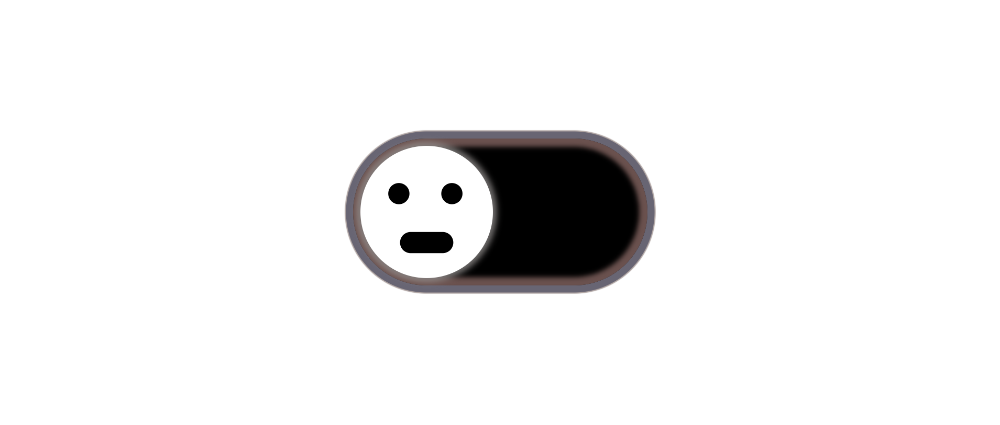
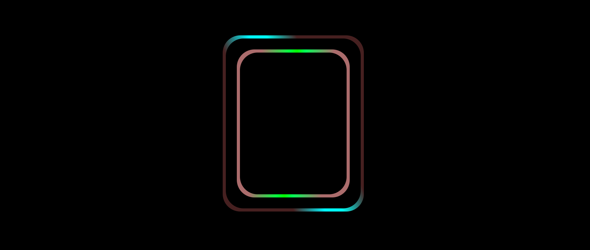

This is dark mode button;
 
This design is inspire from "Online Tutorials";  
 
you can check this;  
 

  
This is hover effect for any inner and outer div and you can also use for your btn.
 

 
There is all of css style   
 
*{
 
    margin: 0;
 
    padding: 0;
 
    box-sizing: border-box;
 
}
 
body{
 
    width: 100vw;
 
    height: 100vh;
 
    display: flex;
 
    justify-content: center;
 
    align-items: center;
 
    background-color: #000;
 
}
 

.outerDiv{
 
    height: 500px;
 
    width: 400px;
 
    background-color: rgb(70, 32, 32);
 
    position: relative;
 
    z-index: 1;
 
    overflow: hidden;
 
    border-radius: 50px;
 
}
 
.outerDiv::after{
 
    position: absolute;
 
    content: " ";
 
    background-color: #000000;
 
    border-radius: 50px;
 
    inset: 9px;
 
    z-index: 3;
 

}
 
.outerDiv::before{
 
    width: 250px;
 
    height: 1000px;
 
    content: ' ';
 
    position: absolute;
 
    background: linear-gradient(90deg,rgba(0, 0, 0, 0) 11%, rgba(0, 247, 255, 1) 44%, rgba(0, 255, 251, 1) 53%, rgba(0, 255, 247, 1) 61%, rgba(0, 0, 0, 0) 93%);
 
    top: 50%;
 
    left:  50%; 
 
    animation: animation1 5s linear infinite;
 
    animation-play-state: paused;
 
    z-index: 2;
 

}

 
@keyframes animation1 {
 
    0%{
 
        transform: translate(-50%,-50%) rotate(0deg);
 
    }
 
    100%{
 
        transform: translate(-50%,-50%) rotate(360deg);
 
    }
 
}
